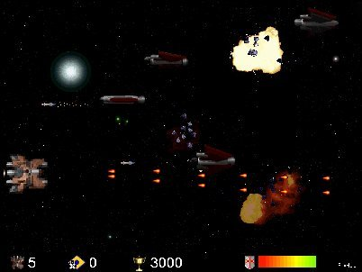



## Space Defender 2

### Description

If you liked Space Defender, you

will like this too, J am sure.

It's not a sequel, it's a new game.

See the Readme.txt file, please.

If you like it then vote it.

Enjoy. Need DirectX 5 or higher.

Update 11/21: Fixed bugs and I have added a new wave of badguys!

For other vb games and demos visit my web site: http://web.tiscali.it/fc_vbgames/index.html
 
### More Info
 

             |
---                |---
**Submitted On**   |2000-01-16 05:03:02
**By**             |[fabio calvi](https://github.com/Planet-Source-Code/PSCIndex/blob/master/ByAuthor/fabio-calvi.md)
**Level**          |Intermediate
**User Rating**    |4.6 (37 globes from 8 users)
**Compatibility**  |VB 5\.0, VB 6\.0
**Category**       |[Games](https://github.com/Planet-Source-Code/PSCIndex/blob/master/ByCategory/games__1-38.md)
**World**          |[Visual Basic](https://github.com/Planet-Source-Code/PSCIndex/blob/master/ByWorld/visual-basic.md)
**Archive File**   |[CODE\_UPLOAD1191111212000\.zip](https://github.com/Planet-Source-Code/fabio-calvi-space-defender-2__1-12922/archive/master.zip)

